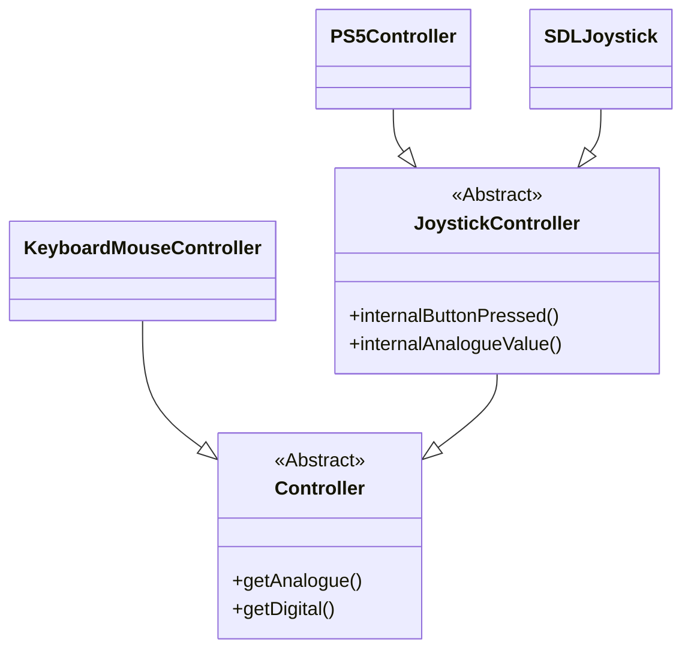

# Controller Implementation

All controllers implement the base `Controller` interface, and are responsible
for mapping actions to inputs.

Actions can expect either an analogue output or digital. For analogue controls,
the range should be inferred from the specific key. Implementers are allowed to
return digital values if their controller does not support analogue, such as
movement on keyboard.

`JoystickController` handles action mapping to joystick buttons, implementers of
`JoystickController` are responsible for mapping their system-specific API to a
generic enum.

`KeyboardMouseController` is a full implementation that takes in platform-specific
keyboard and mouse classes such as `Win32Keyboard` and `SDLKeyboard`.

Controller input is supported on PC builds, as long as SDL2 is used which is required
on Linux and optional on Windows.

