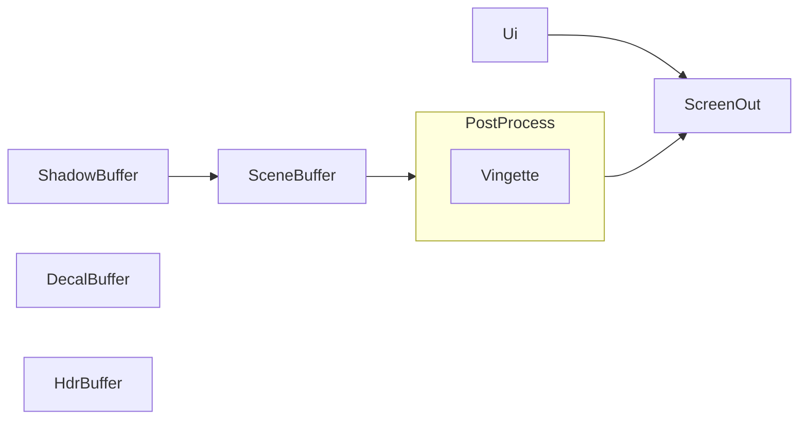

# Rendering on PS5

```mermaid
graph LR
    ShadowBuffer-->SceneBuffer
    SceneBuffer

    DecalBuffer
    HdrBuffer

    SceneBuffer-->PostProcess
    subgraph PostProcess
        Vingette
    end
    PostProcess-->ScreenOut
    Ui-->ScreenOut
```
